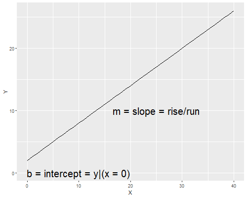
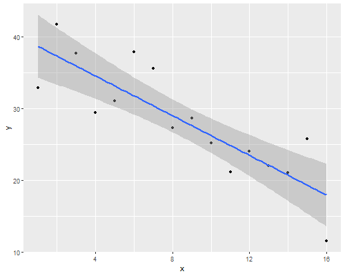
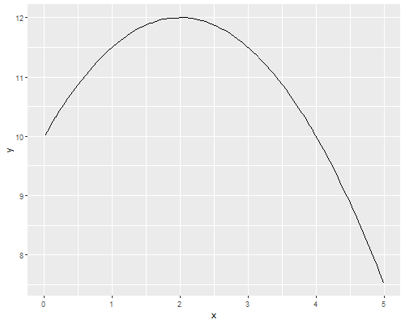

layout: true

background-image: url('lin-plot.png'), url('blbw.png')
background-size: 50%, 20%
background-position: left bottom, top left
---
class: center, right

# Welcome to the (G)LM   

### E.g., meet your best friend

## Andy Crosby  
### January 22, 2024  
<br />

## [Google CoLab Lecture Link](https://colab.research.google.com/drive/11w_u64Gqub03PfAeyAVaSvBpUrAdIfkf#scrollTo=Ae8bmV-qBGz9)
---
layout: false 

## What is a linear model?
A linear model is a model described by the equation of a line.  

$$y = mx+b$$ 



---
# Typically in linear regression, we rearrange it:

### $$y =\alpha+\beta x,$$

### where:  
* ### $y$ is the dependent variable (or 'response' variable);
* ### $x$ is the independent variable (or 'response' variable); 
* ### $\alpha$ is the intercept (i.e., the value of $y$ when $x=0$); and
* ### $\beta$ is the slope of the line, also called the *coefficient*.

## $\beta$ describes the 'relationship' between $y$ and $x$ 


---
# For example:

### The relationship between time (in years), and the population size of a nesting colony of Great Blue Herons (a.k.a. a Rookery or Heronry) 

.pull-left[

]

.pull-right[

]

???
This is easy enough to illustrate with a simulation.

First, we will illustrate a straight-line linear model. Imagine we have a heron rookery that is rapidly declining in size. If we measure the population over a 16 year period, and the population goes from 40 individuals in year 0 to 16 individuals in year 16
---
# Estimating trend with a linear model 
## Model the effect of year on abundance  

## $$y_i=\alpha + \beta x_i + \epsilon_i$$
<br \>


--
### $$response = deterministic + stochastic$$

--

## Stochastic part defined by a distribution 

* ### This is what makes it a ***statistical model*** 

---
# Deterministic Part  

* ## A.K.A. the **'linear predictor'** 

* ## Expected response in absence of stochasticity 

* ## Effects of explanatory variables are additive  
  
* ## Composed of: 
  * ### Design matrix 
  * ### Observed values 

---
# Deterministic Part 

## Note: 'linear' doesn't have to mean 'straight line' 
### $$y=\alpha + \beta_1 x + \beta_2 x^2$$



---
# Stochastic Part 
## Nature is *unpredictable* (i.e. ***stochastic***) 

## There is always an element of *chance* in any outcome 

* ### There is actually a reason: (we just don't know it!) 

* ### Data is a combination of *modeled* (deterministic) and *unmodeled* (stochastic) factors 

* ### These are ***random variables*** 

## Often stochsticity can be described by a ***probability distribution*** 

---
# The Normal (Gaussian) Distribution 
## Distributions are described by parameters, e.g., if: 

## $$y \sim Normal(\mu, \sigma^2)$$

## Parameters  are $\mathbf{\mu}$ and $\mathbf{\sigma}$  

## In normal linear regression, we are trying to estimate $\mu$ and $\sigma$ 

---
```{r, fig.height = 6}
n <- 10000
mu <- 600 
sigma <- 30 

sample <- rnorm(n = n, mean = mu, sd = sigma)
hist(sample)
abline(v = mean(sample), col = "red", lwd = 4)
```
---
# The Design Matrix  
## Represents your *parameterization* of the model 


???
Parameterization = 


